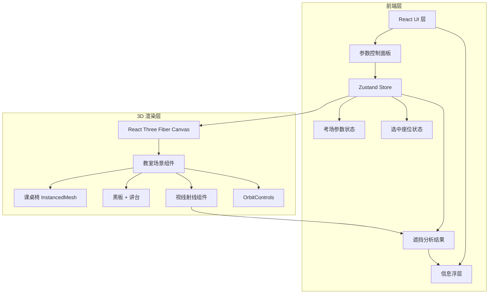
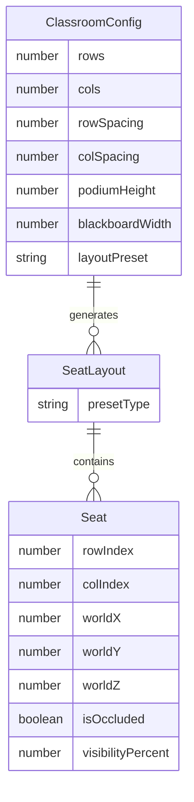

## 1. 架构设计



## 2. 技术说明

- 前端：React@18 + TypeScript + TailwindCSS@3 + Vite
- 3D 渲染：Three.js r160 + @react-three/fiber + @react-three/drei
- 初始化工具：vite-init（react-ts 模板）
- 状态管理：Zustand
- 后端：无（纯前端应用）

## 3. 路由定义

| 路由 | 用途 |
|------|------|
| / | 考场 3D 预览主页（唯一页面） |

## 4. API 定义

无后端 API，所有计算在浏览器端完成。

### 4.1 核心计算逻辑

**视线遮挡检测算法：**
1. 获取选中座位的眼睛坐标（座位中心 + 眼高偏移 ~1.2m）
2. 向黑板左右边缘及中间采样点发射射线（共 5-9 条采样射线）
3. 对每条射线，检查是否与前方任一座位的"头部球体"（半径 ~0.1m，中心高度 ~1.2m）相交
4. 被遮挡的采样点数量 / 总采样点数量 = 遮挡比例
5. 可视黑板比例 = 1 - 遮挡比例

**头部模型：** 使用球体近似，球心位于考生坐姿头顶上方，半径 0.1m

## 5. 服务器架构图

无服务器端，纯前端应用。

## 6. 数据模型

### 6.1 数据模型定义



### 6.2 核心类型定义

```typescript
interface ClassroomConfig {
  rows: number;
  cols: number;
  rowSpacing: number;
  colSpacing: number;
  podiumHeight: number;
  blackboardWidth: number;
  layoutPreset: 'single' | 'double' | 'plum';
}

interface SeatData {
  row: number;
  col: number;
  position: [number, number, number];
  isOccluded: boolean;
  visibilityPercent: number;
}

interface SightlineResult {
  seatIndex: number;
  totalSamples: number;
  blockedSamples: number;
  visibilityPercent: number;
  isOccluded: boolean;
}
```
